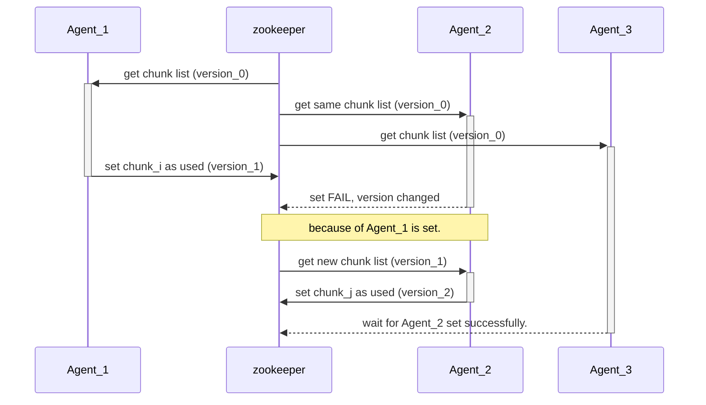

# 背景

最近有个需求涉及到分布式高并发获取资源的场景，简单的来说就是有个包含许多存储块的资源池，多个（并发的）任务处理的agent需要找到可用存储块并向其存储数据。

按以往实践的经验，可以借助**zookeeper全局锁**的强一致性实现，大致思路如下：

1. zk上保存所有存储块的可用容量信息；
2. 每个（独立并发的）agent获取zookeeper上所有存储块的信息，找出最优（比如可用空间最大）的存储块，然后向其存储业务数据，占用其一定的存储空间，（即把扣除后的可用空间写回到zookeeper上）；
3. 因为zookeeper的强一致性，确保了多个agent同时写入也只有1个会写成功，其它会失败；
4. 那么其它的agent只能重新获取zookeeper上的数据，再进入第2步去计算；

上述的方案在大多数场景都是“适用”的。但是在高并发度诉求的场景下，全局锁的存在会严重影响并发度的性能。因为当1个agent写入最新值的时候，原本**最优的**的存储块，可能已经变成非最优，而其它agent只能废弃它们已经选择的“最优”结果，重新向zookeeper获取存储块信息并再次计算。



上图中的version是zookeeper中保证get/set一致性的属性。然而这一过程的影响在高并发度的时候是无法忽略的：当Agent_1获取到最优，并写入zookeeper后，剩下的n-1个agent都因为一致性而重新向zookeeper获取并计算。等Agent_2写入zookeeper后，剩下的n-2又要重新获取。简单地类推这个过程，可以得到影响为（n-1）的阶乘（**这个结果并不严谨，因为Agent_1可能已经完成手上的任务并重新参与这个过程**）：
$$
Infection = (n-1)!
$$

# 假设

出于维持高并发度的考虑，必然需要我们放下强一致性的全局锁方案。可以设想一下，每个（高并发的）agent在路由（选择）可用存储块的时候完全不关联，而是各自独立从zookeeper上获取到存储块信息后，通过1个路由算法$\Phi$的计算，就能得到最优存储块。

这样，对于我们来说，关键问题就是如何找到这个算法$\phi$。

* 性质1：显然这个$\Phi$应该是概率性质的。因为如果$\Phi$的计算是固定，比如只选择可用容量最大的存储块，那么在某一瞬间，所有正在路由的agent都会找到相同的存储块，结果就是该存储块因为大量向其存储数据而负载溢出（空间冲爆了）;
* 性质2：$\Phi$应该是当前agent的并发度$\eta$的函数，否则无法稀释概率，导致多个agent选择相同存储块，最终负载溢出;
* 性质3：$\Phi$虽然是概率性质的，但是空间越大的存储块应该有越高的概率被选择;

第1点是算法$\Phi$的数学性质，第2点是防止溢出的客观约束，第3点是倾向均衡的人为预期。这3点共同保证了：即使初始状态各个存储块的可用空间不一致（例如有些快用尽，而有些新扩容出来），但是随着时间的推移（各高并发agent不断路由并消耗），所有存储块的可用空间应当趋于一致，即达到存储的负载均衡。

**综上所述，这里给出1个均衡路由的设计模型。**

# 均衡路由模型

概率泛函中$\Phi(n(i), \eta, M)$，$n(i)$为第i个存储块的可用空间，$\eta$为agent的并发度，$M$是每次路由占用的空间。

注意：这里的$n(i)$和$M$都是无量纲的归一化值，因为空间只能整块使用，比如存储块1的可用空间有110GB，但是每次任务需要占用30GB，那么$n(1) = 3$，而$M = 1$。

在后续的模型中，我们假定每次需要消耗的空间$M$不变，默认$M = 1$，而$n(i)$必然是$M$的正整数倍，由此重新得到$\Phi(n(i), \eta)$。

同时，增加性质2的稀释约束条件：$\Phi(n(i), \eta) \times \eta \leq n(i)$，避免负载溢出。

出于理解方便，这里把路由计算抽象成把小球存放到柜子里的动作：所有柜子都已按可用空间由大及小排序;

## 双柜模型

首先，简单地介绍下算法，这里先假设有只有2个球柜，最左边的红色小球代表的是agent的并发度$\eta$，图中的渐变色小球表示有50%的概率被选择。


由此，可以得到第1个柜子被选中的概率为: $\Phi(i=0,\eta,\delta)=\dfrac{1}{2} + \dfrac{\delta}{2(\eta)}$；
而第2个柜子被选中的概率为: $\Phi(i=1,\eta,\delta)=\dfrac{1}{2} - \dfrac{\delta}{2(\eta)}$；
这里，$\delta$是第1个柜子比第2个多出来的空格数，此示例中$\delta$，$\delta \in N^+$，引入$\delta$的目的就是为了满足性质3;

可以看出，当并发度$\eta \leq \delta$时，选择第2个柜子的概率为0(**因为概率不能小于0**)。第1个规格被选择的概率则是$100%$。
当并发度$\eta \geq \delta$时，优先填充第1个柜子多出来的2个空格，剩余小球才会随机均分到2个柜子中。
这也是因为算法的性质3，在第1个规格可用较多的时候会倾向于优选1，从而保障2个柜子的整体可用空间在选择后趋向均衡。


## 标准模型
相比双柜模型，实际应用的场景会略微复杂一点。可以放球的柜子不但有多个，而且柜子的可用空间还可能会相等。如图给出7个柜子，可用空间分别为（7，6，6，5，3，3，2）。需要放置15个小球，即并发度$\eta=15$：


标准模型仍然要满足$\Phi$的第3点性质（趋向均衡）：
* 小球趋向于优先填充（occupied）可用空间最多的柜子，一直达到均衡线（Balance）；
* 剩余的小球（Rest requires）只能在Balance上一层可选位置（Rest Available）中随机选择；

因此，可以得到
$$
\Phi=\dfrac{\Delta_{i}+P}{O+NP}
$$

其中，
* $\Delta_{i}$表示第i个柜子在Balance线以下的空间数量；
* $P$表示剩余小球在水位上面选择第i个柜子的朴素概率；
* $O$表示Balance线以下所有occupied的柜子空间；
* $N$表示可被选择的柜子数量，不是所有的柜子都会被选择，远高于Balance的柜子是不考虑的。

分析到这里，没有什么比立即给出算法的伪代码更简单明了的了。
```python
    FUNCTION router() -> probability
        var require = concurrency # 把并发度定义为需要放置小球的数量
        var balance = occupied = avail = rest_avail = rest_require = box_num = 0
        for box in Boxes
            CALCULATE box.diff_vs_next # 比右邻box多的格子数
            box_num += 1
            if box.diff_vs_next == 0
                # 表示相邻2个box的可用格子数相同
                continue

            avail += box_num * box.diff_vs_next
            if avail > require
                break # 截断，远高于Balance线的不再考虑
            
            balance = box.capacity

        for box in Boxes
            if box.capacity <= balance
                break
            box.diff_vs_balance = box.capacity - balance
            occupied += box.diff_vs_balance

        rest_require = require - occupied
        rest_avail   = avail   - occupied

        var r = random()
        P = round(rest_require/rest_avail, 6)
        for box in Boxes
            Phi = round((box.diff_vs_balance + P)/(occupied + box_num * P), 6)
            if r <= Phi
                RETURN box
            r -= Phi

        RETURN NONE
```

# 原型验证

验证模型：
* 随机初始化50个存储块，各自的初始可用空间差异较大，有的超过1000GB，而有的初始就只有300多GB；
* 设置25个agent，各自并发执行route，每次route到可用存储块便会消耗其50GB空间；
* 每个agent都会循环40次，每次之间sleep间隔100～500ms的随机值（模拟agent之间无序、无关联态）。


可以看到：
* 那些初始容量较多的存储块优先被选择，可用容量随时间逐步减少；
* 而初始容量就少的存储块，因为不容易被选择，所以初始减幅很小；
* 随着所有存储块的平均可用空间不断下降，原本不容易被选择的存储块被选到的概率增加，继而可用空间开始减少。
* 最终在不断的消耗下，所有存储块的可用容量都会趋于均衡。

**这就是均衡路由算法。**


